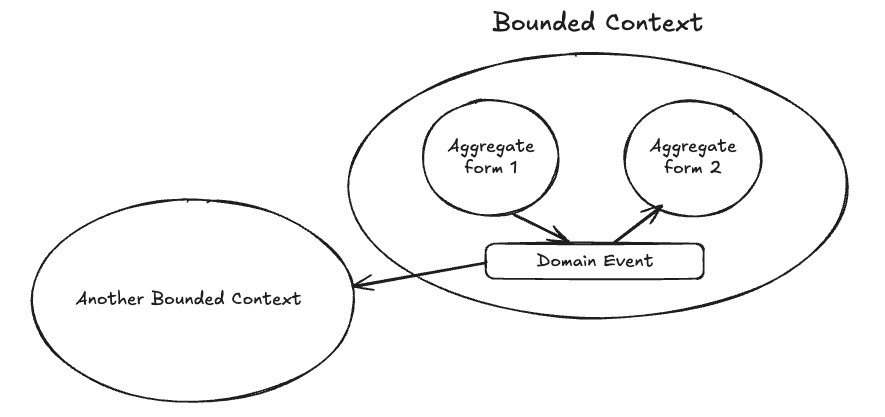

# 목차
- [1장 나에게 도메인 주도 설계는](#1장-나에게-도메인-주도-설계는)
  - [DDD가 우리에게 상처를 줄까?](#ddd가-우리에게-상처를-줄까)
  - [좋은, 나쁜 그리고 효과적인 설계](#좋은-나쁜-그리고-효과적인-설계)
  - [전략적 설계 (2장 ~)](#전략적-설계-2장-)
  - [전술적 설계 (5장 ~)](#전술적-설계-5장-)

## 1장 나에게 도메인 주도 설계는
> 처음 접하는 내용이어서 그런지, 개인적으로 1장의 내용들은 다소 추상적으로 다가왔음
- 비즈니스 요구를 정확하게 `모델링`할 뿐만 아니라, 최상의 소프트웨어 아키텍처로 규모에 맞게 수행될 수 있도록 도와줌
- `DDD`는 높은 가치를 제공하는 소프트웨어를 설계하고 구현하는 데 있어 `전략적`, `전술적`으로 도움을 주는 도구들의 모음
  - `DDD`의 `전략적` 개발 도구
    - 조직은 집중해야 하는 것을 신중하게 선택해야 함 -> 전략적 개발 도구가 소프트웨어 설계 결정들과 비즈니스를 위한 통합적 판단을 도와줌
  - `DDD`의 `전술적` 개발 도구
    - 비즈니스의 고유한 활동을 정확하게 모델링하는 유용한 소프트웨어를 설계하는 데 도움을 줄 수 있음

### DDD가 우리에게 상처를 줄까?
- DDD가 소프트웨어 개발에 대한 복잡한 접근법이라는 이야기가 있음 -> 접근 자체가 복잡하기 보다는, 복잡한 소프트웨어 프로젝트에 사용할 수 있는 고수준 기술들을 모아둔 것임 (저자)

### 좋은, 나쁜 그리고 효과적인 설계
- 릴리스 압박 등으로 스크럼의 가장 중요한 원칙 중 하나인 `지식 획득`은 감안하지 않고, 주로 `일정 관리`를 위해 스크럼을 사용하는 경우(ex. 작업 보드의 할 일을 작업 중으로 옮기는)가 많음
- 소프트웨어 프로젝트는 위험에 빠져 있고, 모든 팀들은 시스템 유지 보수와 매일 코드 및 데이터 패치를 위해 존재한다
- 서서히 확산되는 문제 예시들 (`높은 수준의 비즈니스 문제들로 시작해서 기술적인 내용 순으로 열거`)
    > 1. 소프트웨어 개발을 `이익 중심`이 아닌 `원가 중심`으로 생각 (비즈니스 문화가 확고한 경우, 안타깝게도 이런 상황은 개선되지 않을 수도 있음)
    >
    > 2. 개발자가 너무 기술에만 몰두한 나머지, 문제를 신중하게 연구하고 설계하기보다는 기술적으로 해결하려고 한다
    >
    > 3. 데이터베이스에 너무 큰 우선순위를 부여하고, 대부분의 논의가 비즈니스 프로세스와 업무보다 데이터베이스 주변 솔루션과 데이터 모델에 집중된다
    >
    > 4. 개발자가 비즈니스 목적에 따라 클래스와 오퍼레이션 이름을 짓는 것에 크게 관심 없음 -> 비즈니스가 담고 있는 멘탈 모델과 개발자가 만들어낼 소프트웨어 사이에 큰 차이를 야기함
    > 
    >> 위 문제들은 일반적으로 비즈니스와의 협업이 빈약하기 때문에 발생하는 결과들
    > 
    > 5. 프로젝트에 대한 예측을 매우 강하게 요구한다
    >
    > 6. 개발자가 비즈니스 로직을 사용자 인터페이스 컴포넌트와 영속성 컴포넌트 안에 담는다
    >
    > 7. 문법에 어긋나고 느리거나 권한이 없어 차단되는 데이터베이스 쿼리들이 사용자가 긴급하게 처리해야 하는 비즈니스 업무 수행을 방해한다
    > 
    > 8. 개발자가 실제 구체적인 비즈니스 요구 대신, 과도하게 일반화시킨 해결 방안을 선택한 탓에 잘못된 추상화가 존재한다
    > 
    > 9. 오퍼레이션을 수행하는 서비스가 또 다른 서비스를 직접 호출하는 강하게 결합된 서비스가 존재한다 -> 강결합은 시스템 유지보수가 어려워지고 비즈니스 문제 등을 발생시킴 

- Book Design: A Practical Introduction by Douglas Martin
  > 설계가 필수적인 것인지, 안 해도 괜찮은지에 대한 질문은 요점에서 많이 벗어나 있다.
  > 
  > 설계는 필연적이다. 좋은 설계의 대안은 나쁜 설계다. 절대 설계하지 않는 것이 아니다.

- 심사숙고한 설계로 소프트웨어를 제작하는 것이 비쌀 것 같아서 두렵다면, 앞으로 얼마나 계속 그 시스템을 사용해야 하고, 더 나아가 나쁜 설계를 수정해야 하는 것에 얼마나 더 큰 비용이 들 것인지 생각해야 한다
- 효과적인 설계는 조직이 무엇에 강점을 가져야 하는지 이해시키고, 정확한 소프트웨어 모델을 생성하도록 가이드할 때 사용한다

### 전략적 설계 (2장 ~)

> 전략적 설계부터 시작하지 않으면 효과적인 방법으로 전술적인 설계를 적용할 수 없음
- 전략적 설계는 세부 구현으로 들어가기에 앞서 비즈니스상 전략적으로 중요한 것, 중요도에 따라 일을 나누는 방법 그리고 필요에 따라 통합하는 최적의 방법을 강조
- `Bounded Context(바운디드 컨텍스트)`라는 전략적 설계 패턴을 사용해서 `도메인 모델을 분리`
- 도메인 모델에서 `Ubiquitous Language(보편 언어)`를 개발하는 방법에 대해 살펴볼 예정
- 전략적 설계를 진행하면서 `Subdomains(서브 도메인)`이 무엇이고, 어떻게 기존 시스템의 제한되지 않은 복잡성을 다룰 수 있게 도와주는지 살펴볼 예정
- `Context Mapping(컨텍스트 매핑)`을 통해 여러 개의 바운디드 컨텍스트를 통합하는 방법 확인
- `Context Map(컨텍스트 맵)`은 2개의 바운디드 컨텍스트를 통합하면서 그 사이에 존재하는 팀의 관계, 기술적 메커니즘을 정의

### 전술적 설계 (5장 ~)

- 전술적 설계는 도메인 모델의 세부사항들을 그리기 위해 얇은 붓을 사용하는 것과 같다
- 가장 중요한 도구 중 하나는 `Entity`와 `Value Object(값 객체)`를 알맞은 크기의 `Aggregate`으로 묶는데 사용하는 `Aggregate Pattern`
- `Domain Events(도메인 이벤트)`의 사용은 명확하게 모델링하는 것을 도와주면서, 도메인에 발생한 것에 대해 알아야 하는 내용을 시스템과 공유하는 것을 도움
  - 공유할 대상이 로컬의 바운디드 컨텍스트일 수도, 다른 원격의 바운디드 컨텍스트일 수 있음