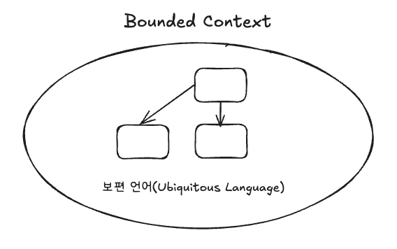
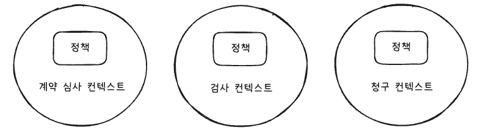
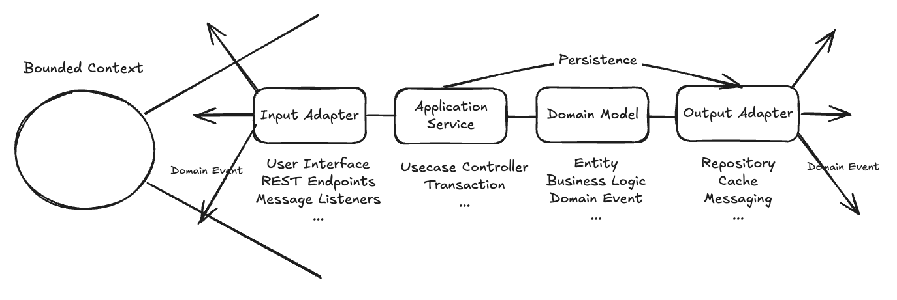

# 목차
- [2장 바운디드 컨텍스트 및 보편언어와 전략적 설계](#2장-바운디드-컨텍스트-및-보편언어와-전략적-설계)
  - [Bounded Context (바운디드 컨텍스트)와 Ubiquitous Language (보편 언어)](#bounded-context-바운디드-컨텍스트와-ubiquitous-language-보편-언어)
    - [Bounded Context (바운디드 컨텍스트)](#bounded-context-바운디드-컨텍스트)
    - [Ubiquitous Language (보편 언어)](#ubiquitous-language-보편-언어)
    - [바운디드 컨텍스트와 팀](#바운디드-컨텍스트와-팀)
  - [도메인 전문가와 비즈니스 동인](#도메인-전문가와-비즈니스-동인)
    - [도메인 전문가](#도메인-전문가)
    - [기술적 복잡도가 아닌 비즈니스 복잡도에 집중하기 ⭐](#기술적-복잡도가-아닌-비즈니스-복잡도에-집중하기-)
  - [보편언어 개발하기](#보편언어-개발하기)
  - [아키텍처](#아키텍처)

# 2장 바운디드 컨텍스트 및 보편언어와 전략적 설계
## Bounded Context (바운디드 컨텍스트)와 Ubiquitous Language (보편 언어)
> DDD는 `Bounded Context(바운디드 컨텍스트)` 내에서 `Ubiquitous Language(보편 언어)`를 모델링

### Bounded Context (바운디드 컨텍스트)
- 의미적으로 동일한 컨텍스트의 범위를 표현
  - 해당 범주 내에서 소프트웨어 모델의 각 컴포넌트는 특정한 의미를 갖고, 수행한다는 의미
- 바운디드 컨텍스트는 `문제 영역` 논의에서 사용할 수 있지만, 필요에 따라 `해결 영역`과도 밀접하게 관련됨
    > `문제 영역`: 상위 수준의 전략적 분석을 수행하고, 주어진 프로젝트 제약사항 내에서 단계를 설계하는 곳
    >> 주요 목표와 위험 사항에 대해 이야기하면서 간단한 다이어그램을 사용할 수도 있음 (컨텍스트 맵) 
    >
    > `해결 영역`: 문제 영역의 논의가 핵심 도메인으로 바라보는 해결 방안을 구현하는 곳 
    >> 바운디드 컨텍스트 내에서 메인 소스, 테스트 소스 코드로 해결 방안을 개발
    >> 다른 바운디드 컨텍스트와의 통합을 지원하는 해결 영역에서도 코드를 생산함 
  
- 바운디드 컨텍스트는 모델이 구현되는 곳이고, 바운디드 컨텍스트마다 각각 분리된 소프트웨어 산출물이 나옴
- 바운디드 컨텍스트가 조직의 핵심 전략적 계획으로 개발되고 있을 때, 이를 `핵심 도메인`이라고 함 -> 가장 중요한 모델 중 하나
  - 기업의 올바른 전략적 결정을 위해 무엇이 `핵심 도메인`이어야 하고, 제외시켜야 하는지 현명히 선택해야 함 -> `DDD의 주된 가치 제안`

- `바운디드 컨텍스트를 사용하는 이유`
  - 처음에는 각자의 도메인 모델을 작고 관리할 수 있는 정도에서 시작하다가 점점 더 추가되는 경우,
  - 경계가 제한되지 않은 모델 안에 너무 많은 개념과 모델 내의 언어가 모호해지게 됨 -> 여러 개의 뒤엉킨 모델 탄생

### Ubiquitous Language (보편 언어)
- 컨텍스트 범위 내의 소프트웨어 모델은 바운디드 컨텍스트 안에서 일하는 팀이 생성
- 그 안에서 기능하는 소프트웨어 모델을 만드는 모든 팀 구성원이 사용하는 언어를 반영
- 해당 언어는 팀 구성원들이 서로 이야기할 때나 소프트웨어 모델 안에 구현되므로 `보편 언어`라고 부름

### 바운디드 컨텍스트와 팀
- 각각의 바운디드 컨텍스트는 단일 팀에만 할당돼야 하고, 각 바운디드 컨텍스트마다 독립적인 소스 코드 리포지토리가 있어야 한다
- 한 팀은 다수의 바운디드 컨텍스트에 대해 일을 할 수 있지만, 다수의 팀이 하나의 바운디드 컨텍스트를 수행할 수는 없다
  - A 팀이 소스 코드를 변경할 때, B 팀에 문제가 발생할 가능성을 차단해야 함
  - 공식 인터페이스를 정의해서 바운디드 컨텍스트를 다른 팀이 사용할 수 있게 허용하기
- 보편언어를 나눈 것과 같은 방법으로 바운디드 컨텍스트마다 소스 코드와 데이터베이스 스키마도 명확히 분리한다

## 도메인 전문가와 비즈니스 동인
- 비즈니스 이해 관계자들의 이야기에는 기술 담당 팀이 더 나은 모델을 만들 때 선택할 수 있게 도와주는 힌트들이 들어있음
- 각 사업 기능이 같은 단어에 대해 서로 다른 정의를 가질 수 있는 경우에는 구분이 필요할 수 있음
  - 예시) 보험 사업 기능에서 정책(Policy)
    - 계약 심사 정책
    - 검사 정책
    - 청구 정책

    
    
### 도메인 전문가
- 도메인 전문가는 다양한 비즈니스 영역들마다 존재 -> `직책이 아닌, 비즈니스에 중점을 두는 사람들을 칭함`
- 개발자는 소프트웨어 개발에 중점을 둠
  - 근거 없는 간결성은 피하고, 해당 팀의 `바운디드 컨텍스트` 안에 팀이 점진적으로 개발하는 보편언어를 수용할 수 있어야 함

### 기술적 복잡도가 아닌 비즈니스 복잡도에 집중하기 ⭐
> DDD를 사용하는 이유는 비즈니스 모델의 복잡도가 높기 때문이다
- 프로젝트의 기술적 측면보다 비즈니스 모델이 더 복잡하기 때문에 `DDD`를 사용한다
- 개발자는 도메인 전문가와 함께 비즈니스 모델을 파고들어야 한다

## 보편언어 개발하기
- 잘 알려진 명사들로 구성된 `보편언어`가 존재할까?
  - 명사 단독으로 사용하는 것보다 실제 일상에서는 훨씬 더 많은 말들을 함께 사용한다는 것을 잊은 채, 도메인 모델 안의 명사에 너무 많은 의미를 부여하는 경향이 있음
- `핵심 도메인`을 명사에만 제한시킬 필요가 없음
  - 그보다는 `핵심 도메인`이 도메인 모델에 나타난 개념에 대한 구체적인 시나리오들을 나타낼 수 있게 만들어야 함

## 아키텍처
- 바운디드 컨텍스트 안에는 `도메인 모델 이상`의 다양한 요소들로 구성되어 있다
- 첨부한 사진에 해당하는 레이어들은 거의 모든 바운디드 컨텍스트 내에 존재한다

