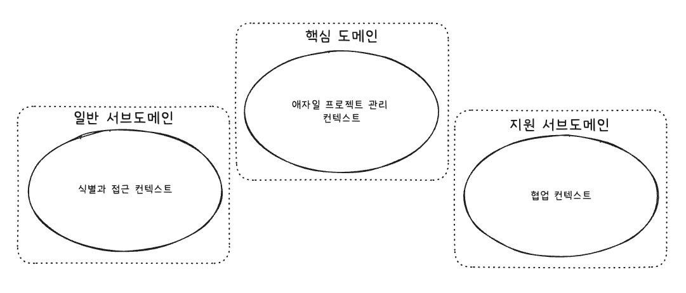

# 목차
- [3장 서브도메인과 전략적 디자인](#3장-서브도메인과-전략적-디자인)
  - [서브도메인은 무엇인가?](#서브도메인은-무엇인가)
  - [서브도메인의 유형](#서브도메인의-유형)
    - [핵심 도메인](#핵심-도메인)
    - [지원 서브도메인](#지원-서브도메인)
    - [일반 서브도메인](#일반-서브도메인)
  - [복잡성 다루기](#복잡성-다루기)

# 3장 서브도메인과 전략적 디자인
- DDD 프로젝트 안에는 다수의 바운디드 컨텍스트가 존재
- 바운디드 컨텍스트들 중 하나는 `핵심 도메인`이 될 것이고, 다른 바운디드 컨텍스트에는 다양한 `서브도메인`이 존재

## 서브도메인은 무엇인가?
- `서브도메인`은 전체 비즈니스 도메인의 하위 부분
- 크고 복잡한 프로젝트에서 문제 영역을 이해할 수 있도록 전체 비즈니스 도메인을 논리적으로 쪼개는 데 서브도메인을 사용할 수도 있다
- 서브도메인을 개발하는 데 DDD를 사용했다면 명확한 바운디드 컨텍스트를 구현할 수 있다
- `바운디드 컨텍스트`와 `서브도메인`은 `일대일(1:1) 관계`를 맺어야 한다
  - 항상 가능한 것은 아니지만, 가능하다면 이렇게 설계하는 것이 중요
  - 바운디드 컨텍스트를 정확하게 유지시키고, 핵심 전략 목표에 집중하는 데 도움을 주기 때문

## 서브도메인의 유형
> 프로젝트에는 세 가지 주요 `서브도메인` 유형이 존재한다
> 
> 1. 핵심 도메인
> 2. 지원 서브도메인
> 3. 일반 서브도메인

### 핵심 도메인
> `보편언어`를 신중하게 만들기 위한 전략적 투자 영역으로, 주요 자원을 할당하는 명시적인 바운디드 컨텍스트이며, 잘 정의된 도메인 모델이 존재한다
- 다른 기업 경쟁자들에 대한 차별화를 만들 영역이므로 `높은 우선순위`를 가짐
- 소프트웨어에서 가장 큰 투자가 필요한 곳

### 지원 서브도메인
> 이미 존재하는 제품으로 해결할 수 없는 맞춤 제작 개발이 필요한 모델링 영역
- 여기에는 `핵심 도메인`에서와 같은 투자 방식을 동일하게 따를 필요는 없음
- 아웃소싱을 고려해볼 수 있음 -> 그러나, `지원 서브도메인` 없이 `핵심 도메인`을 성공시킬 수는 없으므로 여전히 중요한 모델

### 일반 서브도메인
> 기존 제품 구매를 통해 바로 충족 시킬 수 있는 경우에 해당
- 아웃소싱을 할 수도 있고, 다른 도메인들에 비해 중요 비중이 상대적으로 떨어짐

## 복잡성 다루기
- 비즈니스 도메인 안의 시스템 경계 중 일부는 `레거시 시스템`일 가능성이 높다
- 이러한 시스템들이 `핵심 도메인` 프로젝트에 어떤 영향을 주고 있는지는 명확히 해야 한다
- 이런 경우, `문제 영역`에 대해 논의하기 위한 도구로 `서브도메인`을 사용한다
- 실제 상황에서의 일부 레거시 시스템들은 `바운디드 컨텍스트`를 기반으로 설계하는 `DDD`의 방향과는 상충되기 때문에 이것들을 `언바운디드 레거시 시스템`으로 여길 수밖에 없다
- 레거시 시스템 안에 `많은 논리적 도메인 모델`이 존재한다면, 이것을 `서브도메인`으로 생각해볼 수도 있다
  - `논리적 서브도메인`이 큰 시스템의 복잡도를 해결할 수 있도록 도와줄 수 있다
