# 목차
- [4장 컨텍스트 매핑과 전략적 설계](#4장-컨텍스트-매핑과-전략적-설계)
  - [컨텍스트 매핑](#컨텍스트-매핑)
  - [매핑의 종류](#매핑의-종류)
    - [파트너십](#파트너십)
    - [공유 커널](#공유-커널)
    - [고객-공급자](#고객-공급자)
    - [준수자(Conformist)](#준수자conformist)
    - [반부패 계층(Anticorruption Layer)](#반부패-계층anticorruption-layer)
    - [공개 호스트 서비스(Open Host Service)](#공개-호스트-서비스open-host-service)
    - [공표된 언어](#공표된-언어)
    - [각자의 길(Separate Ways)](#각자의-길separate-ways)
    - [큰 진흙 덩어리](#큰-진흙-덩어리)
  - [컨텍스트 매핑 활용하기](#컨텍스트-매핑-활용하기)
    - [SOAP를 이용한 RPC](#soap를-이용한-rpc)
      - [SOAP RPC vs gRPC 비교 (책 내용 외)](#soap-rpc-vs-grpc-비교-책-내용-외)
    - [RESTful HTTP](#restful-http)
    - [Messaging](#messaging)
  - [컨텍스트 매핑 사례](#컨텍스트-매핑-사례)

# 4장 컨텍스트 매핑과 전략적 설계
## 컨텍스트 매핑
- `핵심 도메인`에 다른 `바운디드 컨텍스트`와 통합하는 것을 `컨텍스트 매핑`이라 부른다
- 컨텍스트 매핑된 두 바운디드 컨텍스트 사이에는 `통합`뿐만 아니라 팀 간의 다양한 `관계`도 존재할 수 있다

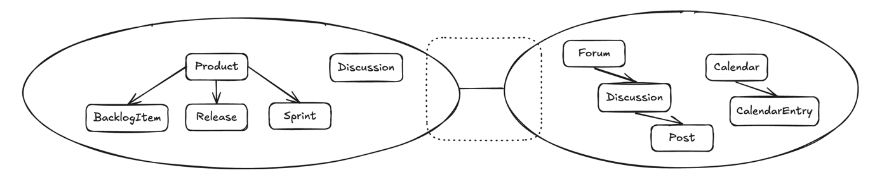

- 2개의 바운디드 컨텍스트 사이의 선이 `컨텍스트 매핑`을 나타낸다

## 매핑의 종류
- 컨텍스트 매핑으로 관계 또는 통합을 표현할 수 있음
> 파트너십
> 
> 공유 커널
> 
> 고객-공급자
> 
> 준수자(Conformist)
> 
> 반부패 계층(Anticorruption Layer)
> 
> 공개 호스트 서비스(Open Host Service)
> 
> 공표된 언어
> 
> 각자의 길(Separate Ways)
> 
> 큰 진흙 덩어리

### 파트너십
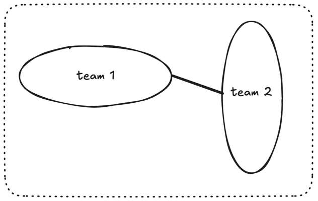

> 각 팀은 하나의 `바운디드 컨텍스트`를 책임지고, `일련의 목표`에 대한 의존성을 맞추기 위해 `파트너십`을 구성한다
- 서로 밀접한 관련이 있으므로 상호간 의존적인 작업이나 여러 일정들을 조율하고, 지속적인 통합에 노력해야 한다
- 파트너십이 상호간 이점을 제공한다면 관계를 지속시키고, 서로의 의존성이 줄어들어 이점이 사라진다면 다른 관계로 매핑을 설정해야 한다
- `두 팀 사이에 굵은 매핑 선으로 표시`

### 공유 커널
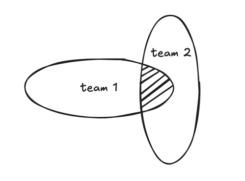

> 두 바운디드 컨텍스트의 교차 지점으로 표시하는 공유 커널은 `2개 이상` 팀 사이에 `공통인 모델`을 `공유`하는 관계
- 공유하는 모델의 코드, 빌드를 관리하고 테스트하는 것은 한 팀에서 맡아 수행한다

### 고객-공급자
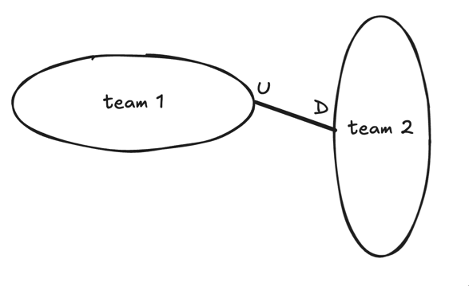

> 2개의 바운디드 컨텍스트와 각 팀들의 관계를 나타내는데 `공급자`는 상류(`U`pstream), `고객`은 하류(`D`ownstream)로 표현한다
- `공급자`는 고객이 원하는 것을 제공해야 하기 때문에 관계를 주도하는 것은 `공급자`
  - 고객이 언제 무엇을 받게 될지는 결국 `공급자`가 결정

### 준수자(Conformist)
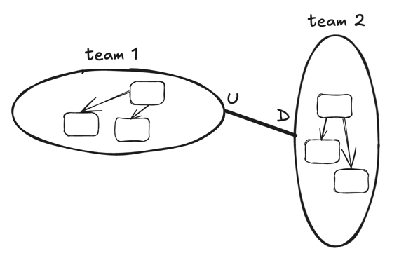

> 상류와 하류 팀이 있고, 상류 팀이 하류 팀의 특정 요구에 지원할 동기가 없는 경우에 나타난다
- 하류 팀은 현재의 상류팀 모델을 그대로 따른다
  - 상류 모델의 `보편 언어`를 계속 변환시키는 것은 쉽지 않기 때문
- 확실하게 자리 잡은 거대하고 복잡한 모델과의 통합이 필요할 때 이런 유형이 나타난다
- 예시
  - 아마존과 제휴하는 판매자 중 하나가 아마존 시스템과 통합하려고 할 때, 아마존 모델을 준수하는 경우

### 반부패 계층(Anticorruption Layer)

> 하류 팀이 그들의 보편언어 모델과 상류 팀의 보편언어 모델 사이에 `번역 계층`을 만듦
- `가장 방어적인 컨텍스트 매핑 관계`
- 가능하다면 하류 모델과 상류 통합 모델 사이에 반부패 계층을 만들어야 한다
  - 통합에 용이한 모델 개념들을 만들 수 있음
  - 원하는 형태의 특정 비즈니스 요구 맞추기 가능
  - 외부의 이질적인 개념으로부터 독립성 유지 가능

### 공개 호스트 서비스(Open Host Service)
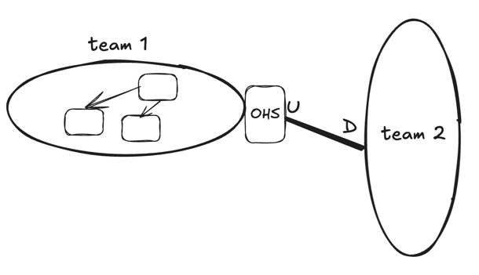

> 바운디드 컨텍스트에 대한 접근을 제공하는 `프로토콜`이나 `인터페이스`를 정의
- 프로토콜은 바운디드 컨텍스트와 통합하고자 하는 모두가 사용할 수 있도록 `공개`되어 있다
  - `API`로 제공 가능

### 공표된 언어
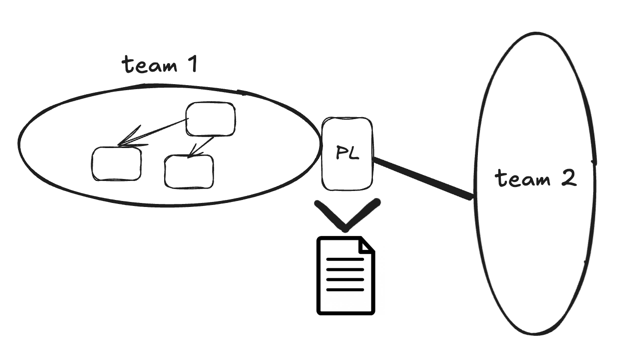

> 바운디드 컨텍스트의 규모에 관계없이, 모두 간단한 사용과 번역을 가능하게 하는 잘 문서화된 정보 교환 언어
- 공표된 언어는 `XML`, `JSON`, `Protobuf`, `Avro(아브로)` 처럼 좀 더 최적화된 작성 형식으로 정의할 수 있다
- 보통 공개 호스트 서비스는 서드파티에게 최상의 통합 경험을 줄 수 있는 공표된 언어를 제공한다

### 각자의 길(Separate Ways)
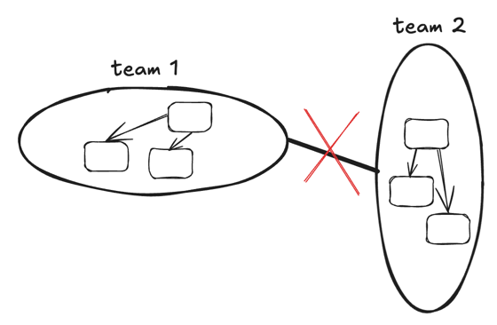

> 1개 이상의 바운디드 컨텍스트를 통합으로 다양한 보편언어를 사용하는 것이 유의미한 결과를 제공하지 못하는 상황
- 이 경우에는 바운디드 컨텍스트 내에서 이를 위한 해결 방안을 만들기

### 큰 진흙 덩어리
| 큰 진흙 덩어리                                         | 반부패 계층으로 방어                                      |
|--------------------------------------------------|--------------------------------------------------|
| 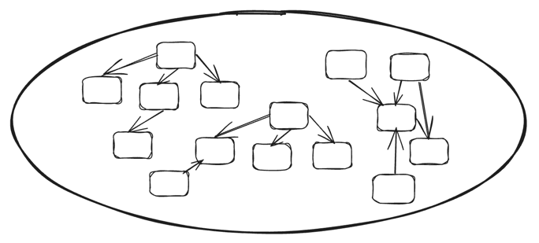 | 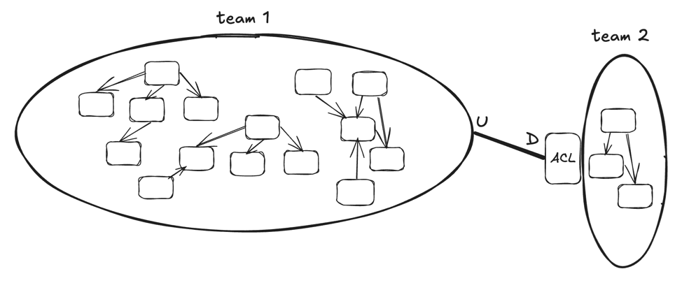 |

- 이러한 상황을 만들지 않도록 기를 쓰고 피해야 함
- 큰 진흙 덩어리가 야기하는 문제점들
  - 부적절한 연결과 의존으로 인해 문제를 확산시키는 `에그리게잇`이 증가
  - 한 가지 문제가 해결돼도 또 다른 문제를 계속 야기시킬 수 있음
- `불가피하게 외부의 큰 진흙 덩어리와 반드시 통합해야 한다면, 각 레거시 시스템에 대응한 반부패 계층을 만들어서 자신의 모델을 보호해야 한다`

## 컨텍스트 매핑 활용하기
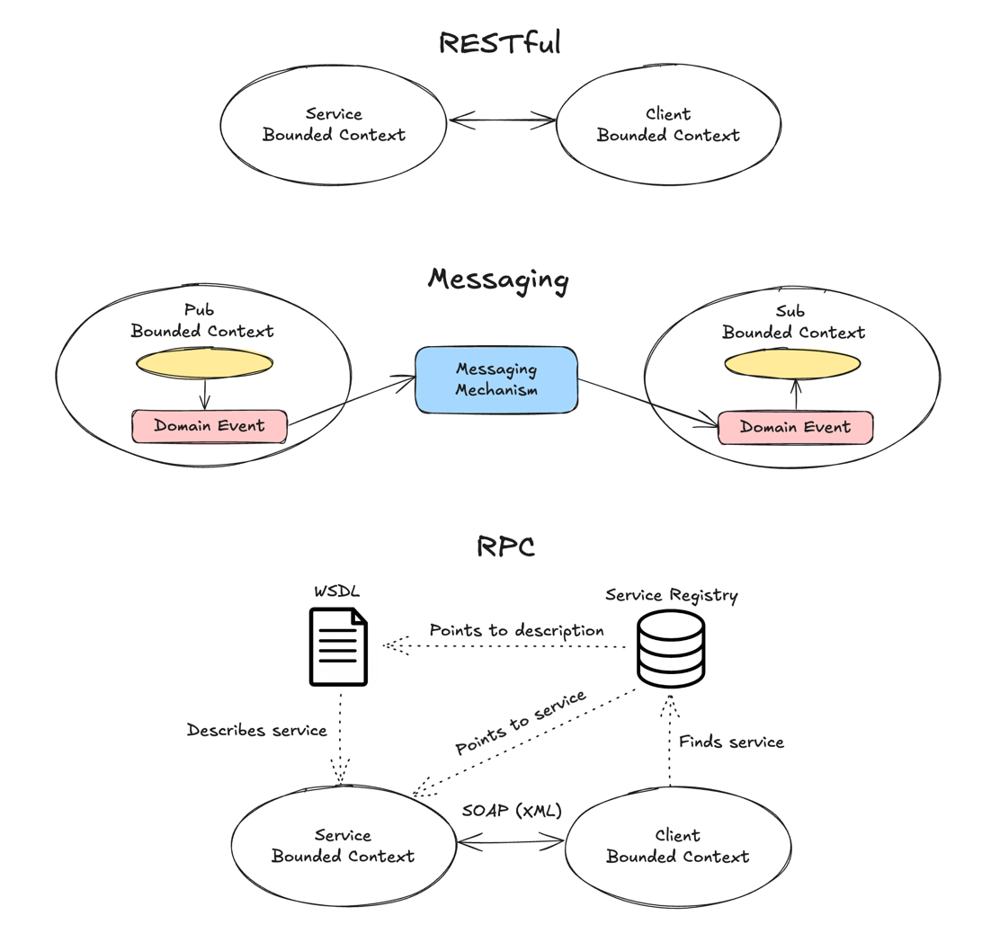

- 바운디드 컨텍스트를 소유한 팀에 따라 `SOAP을 이용한 RPC`, `발행-구독을 활용한 메시징`, `RESTful HTTP` 등의 방식일 수 있다
- `SOAP을 이용한 RPC` -> `RESTful HTTP` -> `Messaging` 순서로 더 견고해지는 통합 방법

### SOAP를 이용한 RPC
> SOAP(Single Object Access Protocol)
> 
> RPC(Remote Procedure Call)

- RPC는 다양한 방법으로 동작하는데, RPC의 잘 알려진 사용법 중 하나는 SOAP를 이용하는 방법
- RPC -> `다른 시스템이 서비스를 사용할 때 마치 단순히 로컬 프로시저나 메서드를 호출하는 것처럼 사용한다는 개념`
- SOAP가 보장해야하는 점
  - 네트워크상에서의 요청
  - 원격 시스템에 요청 전달
  - 성공적 수행
  - 네트워크를 통한 결과 반환
- 하지만, 첫 통합 수행 시점에 예기치 못한 네트워크 장애 등으로 지연 가능성을 동반할 수 있음
- 또한 SOAP을 이용한 RPC는 `클라이언트 바운디드 컨텍스트`와 서비스를 제공하는 `서비스 바운디드 컨텍스트` 사이의 `강결합`을 암시

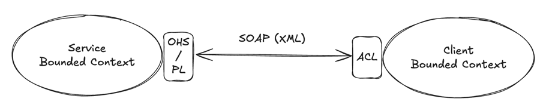

- RPC가 동작하는데 문제가 없다면, 통합하기에 매우 좋은 방법일 수는 있음
- `공표된 언어`로 공개 호스트 서비스를 제공하는 API를 두고, 원치 않는 외부의 영향으로부터 `클라이언트 바운디드 컨텍스트`를 분리할 필요가 있다면, `반부패 계층`을 정의하기

### SOAP RPC vs gRPC 비교 (책 내용 외)
> 기존에 알고있던 gRPC와 "RPC"라는 개념을 공유하지만, 방식이 다른 것 같아 정리했음

| 항목           | SOAP 기반 RPC                             | gRPC                                     |
| ------------ | --------------------------------------- | ---------------------------------------- |
| **전송 프로토콜**  | 주로 HTTP/1.1                             | HTTP/2                                   |
| **메시지 포맷**   | XML 기반 SOAP Envelope (무겁고 verbose)      | Protocol Buffers (Protobuf, 가볍고 바이너리)    |
| **인터페이스 정의** | WSDL(Web Services Description Language) | .proto 파일                                |
| **통신 방식**    | 요청/응답 중심 (동기적)                          | 요청/응답 + 스트리밍(서버 스트림, 클라이언트 스트림, 양방향 스트림) |
| **성능**       | 느림 (XML 파싱 비용 높음)                       | 매우 빠름 (바이너리 + HTTP/2)                    |
| **에러 처리**    | SOAP Fault 정의                           | gRPC Status code 사용                      |
| **사용 목적**    | 레거시 시스템, 기업 내 엔터프라이즈 통신                 | 마이크로서비스, 실시간 통신, 고성능 서비스                 |
| **확장성/유연성**  | 낮음                                      | 높음                                       |

### RESTful HTTP
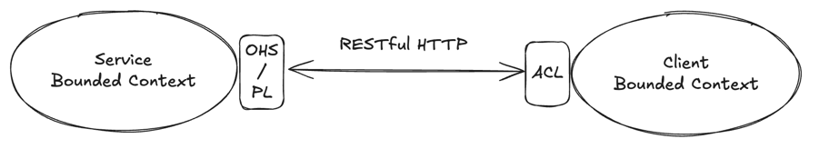

- REST 인터페이스를 제공하는 서비스 바운디드 컨텍스트는 `공개 호스트 서비스`와 `공표된 언어`를 제공해야 한다
  - `공표된 언어`로 `리소스를 정의`하고 `REST URI`로 구성하면 온전한 `공개 호스트 서비스`를 구성할 수 있음
- REST를 사용할 때 저지르는 흔한 실수 -> `도메인 모델` 안에 직접적으로 `애그리게잇`을 반영하는 리소스를 설계
  - 모든 클라이언트에게 준수자 관계를 강요하면서, 모델 변화가 리소스의 형태에 영향을 주게 됨
- 리소스가 `클라이언트 주도`의 `유스케이스`를 지원할 수 있도록 종합적으로 설계해야 함
  - 종합적 -> 제공하는 리소스가 클라이언트들이 원하는 것에 대한 구성이 되도록 고려해야 한다는 의미

### Messaging
> 발행-구독(Publish-Subscribe)

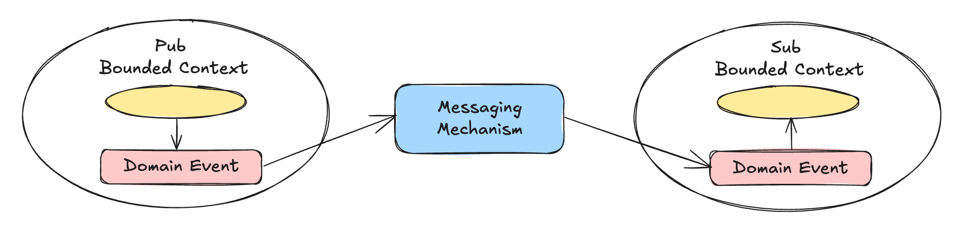

- 즉각적인 결과가 필수적이지 않을 때는 메시징을 이용해 좀 더 견고한 시스템을 구축할 수 있다
- RPC나 REST와 달리, 분절된 형태와의 일시적인 결합을 대부분 제거할 수 있다

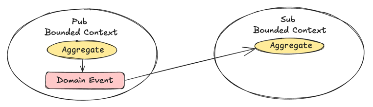

- 일반적으로 `바운디드 컨텍스트` 내의 `애그리게잇`은 `도메인 이벤트`를 만들 때 관심 있는 다른 컨텍스트들은 `발생된 이벤트`를 사용한다
  - `구독 바운디드 컨텍스트`가 `도메인 이벤트`를 받으면, 이벤트의 형태와 값을 토대로 동작을 수행
  - `소비하는 바운디드 컨텍스트` 안에 새로운 `애그리게잇`을 생성하거나, 기존 `애그리게잇`을 수정해야 할 때가 있음

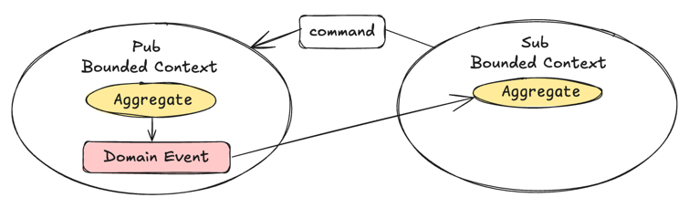

- 가끔은 `클라이언트 바운디드 컨텍스트`가 `서비스 바운디드 컨텍스트`에게 특정한 수행을 하도록 `커맨드 메시지`를 보낼 필요가 있다
- 이러한 경우에도 `클라이언트 바운디드 컨텍스트`는 발행된 `도메인 이벤트`의 형태로 결과를 받는다

> 멱등성 : 연산을 여러 번 적용해도 결과가 달라지지 않는 성질을 의미한다
> 
> ex) 절댓값 함수는 멱등 법칙을 만족

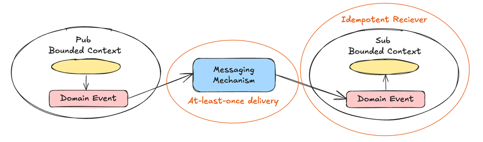

- 통합에 메시징을 사용하는 모든 경우, `적어도 한 번의 전달(At-least-once delivery)`을 통해 모든 메시지의 `수신을 보장`해야 한다
- `구독 바운디드 컨텍스트`가 `멱등 수신자(Idempotent Receiver)`로 구현돼야 함을 의미한다

## 컨텍스트 매핑 사례