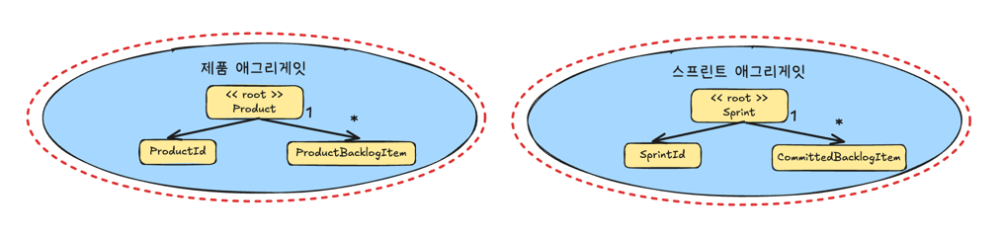
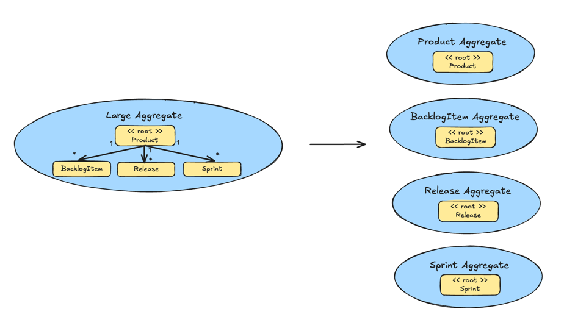
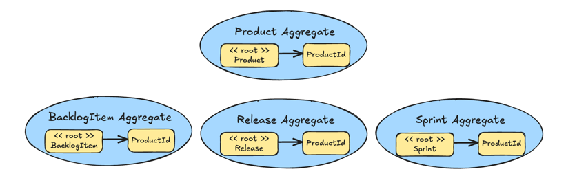

# 목차
- [5장 애그리게잇과 전술적 설계](#5장-애그리게잇과-전술적-설계)
  - [엔터티](#엔터티)
  - [값 객체](#값-객체)
  - [애그리게잇](#애그리게잇)
  - [애그리게잇 경험 법칙](#애그리게잇-경험-법칙)
    - [1. 애그리게잇 경계 내에서 비즈니스 불변사항들을 보호하기](#1-애그리게잇-경계-내에서-비즈니스-불변사항들을-보호하기)
    - [2. 작은 애그리게잇을 설계하기](#2-작은-애그리게잇을-설계하기)
    - [3. 오직 식별자로만 다른 애그리게잇을 참고하기](#3-오직-식별자로만-다른-애그리게잇을-참고하기)
    - [4. 결과적 일관성을 사용해 다른 애그리게잇을 갱신하기](#4-결과적-일관성을-사용해-다른-애그리게잇을-갱신하기)
  - [애그리게잇 모델링](#애그리게잇-모델링)
    - [추상화를 조심스럽게 선택하기](#추상화를-조심스럽게-선택하기)
    - [테스트 가능한 단위](#테스트-가능한-단위)

# 5장 애그리게잇과 전술적 설계

> 5장에서 다룰 2개의 바운디드 컨텍스트

- `애자일 프로젝트 관리 컨텍스트` 라는 이름의 `핵심 도메인` (좌)
- `컨텍스트 매핑` 통합 기반의 협업 도구를 제공하는 지원 `서브도메인` (우)

## 엔터티
- 각 `엔터티`는 같은 형태를 띠거나 다른 형태의 `엔터티`들과의 특성을 구별할 수 있는 `고유한 식별성`을 갖는다
- 다른 모델링 수단들과 `엔터티`를 구분해주는 주 요인은 `유일성`, 즉 그것의 `독립성`에 있다

## 값 객체
- 엔터티와 달리 `고유한 식별성이 없으며`, 값 형태로 캡슐화된 속성을 비교함으로써 동일함이 결정된다
- `값 객체`가 어떤 것을 나타낸다기보다는 엔터티를 서술하고, 측정하는 데 사용된다

## 애그리게잇
- [Martin Fowler - DDD_Aggregate](https://martinfowler.com/bliki/DDD_Aggregate.html)
  - Aggregate는 도메인 규칙을 지키기 위해 한 번에 일관성 있게 변경되어야 하는 객체들의 그룹이며, 
  - Aggregate Root를 통해서만 접근/변경되는 트랜잭션 경계

- `두 바운디드 컨텍스트` 안에 동그라미 쳐진 개념들 각각은 `애그리게잇`이며
- 반면 동그라미를 치지 않은 `Discussion`은 `값 객체(Value Object)`로 모델링한 것이다

- 각 `애그리게잇`은 1개 이상의 `엔터티`로 구성되고, 그중 한 엔터티는 `애그리게잇 루트`라고 부른다
- 애그리게잇은 값 객체를 포함할 수 있다
- 각 `애그리게잇의 루트 엔터티`는 애그리게잇 안의 다른 모든 요소를 `소유`한다
- `루트 엔터티`의 명칭은 `애그리게잇의 개념적 명칭`이다
    - 적절히 표현할 수 있는 명칭으로 루트 엔티티 명칭을 정의해야함

- `각 애그리게잇`은 `일관성 있는 트랜잭션 경계`를 형성한다
  - 트랜잭션 제어가 데이터베이스에 커밋될 때, 
  - 한 애그리게잇 내의 모든 구성 요소는 반드시 비즈니스 규칙을 따르면서 일관성 있게 처리된다는 것을 의미한다
- `트랜잭션 경계를 두는 이유` -> `비즈니스 때문`
  - 애그리게잇이 유효한 상태인지, 아닌지를 결정하는 것은 비즈니스와 관련돼 있는 일이기 때문
- `애그리게잇 형태 2` 인스턴스는 `애그리게잇 형태 1` 인스턴스로부터 `분리된 트랜잭션으로 제어`돼야 한다 `(반대도 마찬가지)`

## 애그리게잇 경험 법칙
> 아래 규칙들은 반드시 준수해야하는건 아니지만 효과적으로 동작하는 애그리게잇을 설계할 수 있도록 도움을 주는 가이드

1. 애그리게잇 경계 내에서 비즈니스 불변사항들을 보호하기
2. 작은 애그리게잇을 설계하기
3. 오직 ID를 통해 다른 애그리게잇을 참고하기
4. 결과적 일관성을 사용해 다른 애그리게잇을 갱신하기

### 1. 애그리게잇 경계 내에서 비즈니스 불변사항들을 보호하기

- 트랜잭션이 커밋될 때 비즈니스의 일관성이 지켜지는 것에 기반을 두고 애그리게잇 구성 요소를 결정해야 한다는 의미
  - ex. Product는 트랜잭션의 끝에 ProductBacklogItem 인스턴스로 구성되는 모든 것이 반드시 Product의 루트와 일관되게 처리되도록 설계

### 2. 작은 애그리게잇을 설계하기

- 각 애그리게잇의 메모리 사용량과 트랜잭션 범위가 비교적 작아야 한다
- 설계할 때 SRP(Single Responsibility Principle)를 고려해야 한다

### 3. 오직 식별자로만 다른 애그리게잇을 참고하기

- 앞서 큰 클러스터 `Product`를 4개의 작은 애그리게잇으로 분해했는데, 각각의 애그리게잇들은 `Product`를 참고할 때 `ProductID` 식별자를 활용하게 된다
- 장점
  - 애그리게잇을 작게 유지하고, 동일한 트랜잭션 내에 여러 애그리게잇을 수정하려는 접근을 방지해준다
  - 관계형 DB, 문서형 DB, 키/밸류 리포지토리 등과 같은 다른 형태의 저장 메커니즘으로도 쉽게 저장할 수 있다

### 4. 결과적 일관성을 사용해 다른 애그리게잇을 갱신하기
- `메시징 메커니즘`으로 구독을 통해 관심있는 파티들에게 `도메인 이벤트`를 전달한다
- 관심 있는 바운디드 컨텍스트는 도메인 이벤트를 발행한 컨텍스트일 수도 있고, 다른 바운디드 컨텍스트일 수도 있다

## 애그리게잇 모델링
- `빈약한 도메인 모델` 조심하기 -> 객체지향 도메인 모델을 사용하면서, 모든 애그리게잇이 비즈니스 행위가 아닌 getter/setter 공개 접근자만 갖는 것
  - 비즈니스보다 기술적인 부분에 초점을 맞췄을 때 발생하는 문제
- DDD를 사용할 때는 바운디드 컨텍스트 내의 보편언어를 모델링한다는 것을 기억해야 한다
  - ex. Product 애그리게잇의 모든 부분은 보편언어에 따라 모델링해야 한다

### 추상화를 조심스럽게 선택하기
- 효과적인 소프트웨어 모델은 비즈니스의 방식을 고려한 일련의 추상화에 기반을 두지만, 지나칠 정도로 추상화를 적용하는 문제도 발생함
  - 추상화 수준이 너무 높아서 각 개별적인 형태의 세부 사항을 모델링하기 시작하면 어렵고 비용 낭비 가능

### 테스트 가능한 단위
- 단위 테스트를 위해 애그리게잇을 철저하게 캡슐화되도록 설계하기
