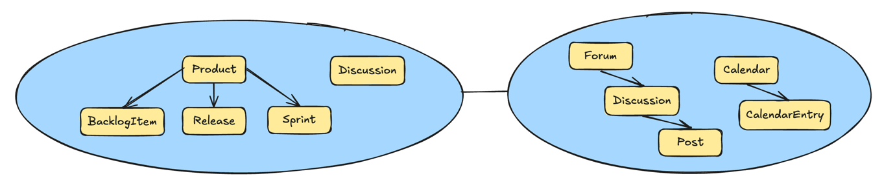
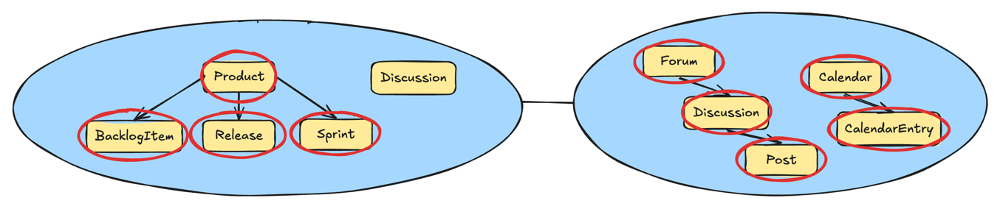
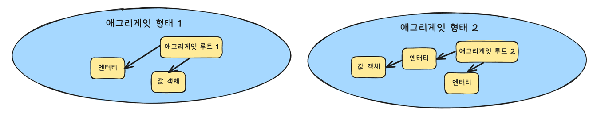
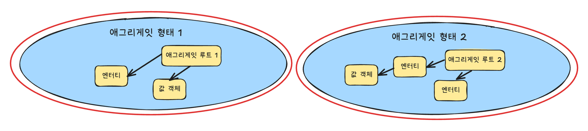

# 목차
- [5장 애그리게잇과 전술적 설계](#5장-애그리게잇과-전술적-설계)
  - [엔터티](#엔터티)
  - [값 객체](#값-객체)
  - [애그리게잇](#애그리게잇)

# 5장 애그리게잇과 전술적 설계

> 5장에서 다룰 2개의 바운디드 컨텍스트

- `애자일 프로젝트 관리 컨텍스트` 라는 이름의 `핵심 도메인` (좌)
- `컨텍스트 매핑` 통합 기반의 협업 도구를 제공하는 지원 `서브도메인` (우)

## 엔터티
- 각 `엔터티`는 같은 형태를 띠거나 다른 형태의 `엔터티`들과의 특성을 구별할 수 있는 `고유한 식별성`을 갖는다
- 다른 모델링 수단들과 `엔터티`를 구분해주는 주 요인은 `유일성`, 즉 그것의 `독립성`에 있다

## 값 객체
- 엔터티와 달리 `고유한 식별성이 없으며`, 값 형태로 캡슐화된 속성을 비교함으로써 동일함이 결정된다
- `값 객체`가 어떤 것을 나타낸다기보다는 엔터티를 서술하고, 측정하는 데 사용된다

## 애그리게잇
- [Martin Fowler - DDD_Aggregate](https://martinfowler.com/bliki/DDD_Aggregate.html)
  - Aggregate는 도메인 규칙을 지키기 위해 한 번에 일관성 있게 변경되어야 하는 객체들의 그룹이며, 
  - Aggregate Root를 통해서만 접근/변경되는 트랜잭션 경계

- `두 바운디드 컨텍스트` 안에 동그라미 쳐진 개념들 각각은 `애그리게잇`이며
- 반면 동그라미를 치지 않은 `Discussion`은 `값 객체(Value Object)`로 모델링한 것이다

- 각 `애그리게잇`은 1개 이상의 `엔터티`로 구성되고, 그중 한 엔터티는 `애그리게잇 루트`라고 부른다
- 애그리게잇은 값 객체를 포함할 수 있다
- 각 `애그리게잇의 루트 엔터티`는 애그리게잇 안의 다른 모든 요소를 `소유`한다
- `루트 엔터티`의 명칭은 `애그리게잇의 개념적 명칭`이다
    - 적절히 표현할 수 있는 명칭으로 루트 엔티티 명칭을 정의해야함

- `각 애그리게잇`은 `일관성 있는 트랜잭션 경계`를 형성한다
  - 트랜잭션 제어가 데이터베이스에 커밋될 때, 
  - 한 애그리게잇 내의 모든 구성 요소는 반드시 비즈니스 규칙을 따르면서 일관성 있게 처리된다는 것을 의미한다
- `트랜잭션 경계를 두는 이유` -> `비즈니스 때문`
  - 애그리게잇이 유효한 상태인지, 아닌지를 결정하는 것은 비즈니스와 관련돼 있는 일이기 때문
- `애그리게잇 형태 2` 인스턴스는 `애그리게잇 형태 1` 인스턴스로부터 `분리된 트랜잭션으로 제어`돼야 한다 `(반대도 마찬가지)`