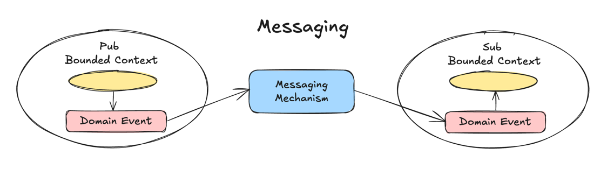

# 목차
- [6장 도메인 이벤트와 전술적 설계](#6장-도메인-이벤트와-전술적-설계)

# 6장 도메인 이벤트와 전술적 설계

> 도메인 이벤트는 바운디드 컨텍스트 내의 비즈니스 관점에서 중요한 사항들에 대한 기록

- `인과관계가 있는 오퍼레이션`(한 오퍼레이션이 다른 것의 원인이 되는)은 특정한 요청이 발생되지 않으면 인과관계에 있는 오퍼레이션은 발생할 수 없다
  - 즉, 특정한 오퍼레이션이 다른 애그리게잇에서 발생하기 전에는 한 애그리게잇이 생성되거나 수정될 수 없음

## 도메인 이벤트를 설계, 구현, 사용하기
- 도메인 이벤트 이름 생성시, 도메인 모델의 보편 언어 반영하고 과거형 동사로 표현
- 도메인 이벤트 프로퍼티에 너무 많은 데이터를 담지 않도록 주의
- 도메인 이벤트가 이벤트 리포지토리에 한 번 저장되면, 이벤트에 관심있는 어떤 대상에게든지 전달될 수 있다
  - 바운디드 컨텍스트 내/외부
- 일부 도메인 이벤트가 명령에 의해 유발될 수 있고, 다른 경우에는 일자, 시간과 같은 상태가 변경되는 것들의 인지를 통해 유발될 수 있다

## 이벤트 소싱
- 이벤트 소싱은 애그리게잇 인스턴스에 대해 변경된 것에 대한 기록으로, 발생했던 모든 도메인 이벤트를 저장하는 것을 말한다
  - 즉, 애그리게잇 상태 전체를 저장하는 대신, 발생했던 각 도메인 이벤트 모두를 저장
- 구성 방식
  - 하나의 애그리게잇 인스턴스에 발생했던 모든 도메인 이벤트를 발생한 순서대로 이벤트 스트림에 구성
  - 애그리게잇 인스턴스에 새로운 도메인 이벤트가 발생하면, 이벤트 스트림의 마지막에 추가
- 이벤트 리포지토리
  - 모든 도메인 이벤트를 추가하는 순차적인 리포지토리 컬렉션 또는 테이블
  - 이벤트 스토어는 오직 추가만 가능한데, 이런 특성으로 인해 리포지토리 메커니즘은 매우 빠르게 동작한다
- 이벤트 소싱을 사용함으로써 얻을 수 있는 이점
  - 핵심 도메인에서 계속 발생하는 모든 기록을 개별적인 발생 수준으로 저장한다는 점